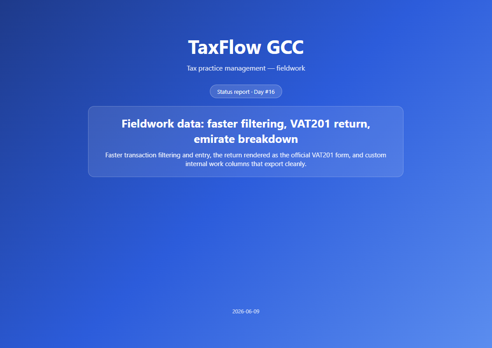
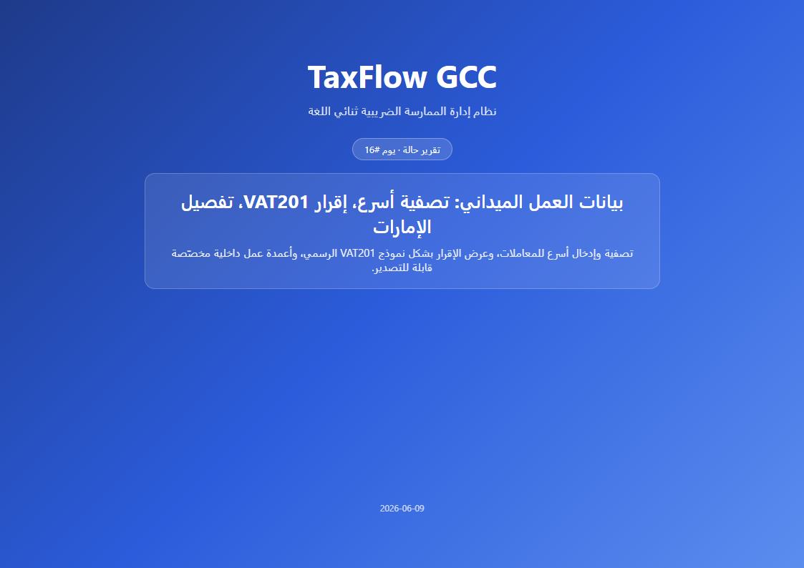

# status-reporter

A two-step daily status reporting plugin for Claude Code. Capture each work session as you go, then
render one polished, client-ready **PDF** — in English or Arabic, from a single template.

| | |
|---|---|
|  |  |
| *English · LTR* | *العربية · RTL* |

One template, one config field — the same report renders left-to-right or right-to-left.

## Install

```
/plugin marketplace add OneStudio/status-reporter      # or a local path to this folder
/plugin install status-reporter@status-reporter
```

Then in any project: `/status-log` during sessions, `/status-export` at day's end.

| Command | Role |
|---|---|
| `/status-log [note]` | **Capture** — append the current session's delivered work as a standalone, append-only fragment under `docs/status/days/_fragments/<DATE>/<HHMM>.md`. Run it any number of times per day; sessions never collide. |
| `/status-export [YYYY-MM-DD]` | **Generate** — merge + de-duplicate + polish all of the day's fragments (and any existing day file) into one day file, render it through a fixed HTML template, and produce a professional landscape A4 **PDF** at `docs/status/reports/<DATE>-status.pdf`. |

## Design

- **Capture is cheap and frequent; generation is heavy and once.** This is the split that solves the "multiple sessions in one day" pain — fragments are append-only and merged at export time.
- **Cross-platform (Windows / macOS / Linux).** File work uses Claude's native Read/Write/Glob tools; the few genuine shell steps (date, render, archive) ship in both bash and PowerShell. The PDF is rendered by a **headless Chromium-family browser via its CLI** (`--headless --print-to-pdf`) — **no static server, no MCP server required, no `php`**. A Playwright MCP, if installed, is used only as a fallback when no browser binary is found.
- **No messaging side-channels.** The plugin only writes inside `docs/status/`. (The original TaxFlow version pushed the PDF to WhatsApp; that coupling was removed.)
- **Per-project name + language via a one-time config.** On the first `/status-export` in a project, you're asked for the **project name** and the **default language** (`ar` / `en`); the answer is saved to `docs/status/config.json` and reused silently afterwards. Edit that file anytime to rename the project or switch language. Language drives the PDF chrome direction (RTL/LTR), the language Claude writes the content in, and the scope-filter table.

  ```json
  { "project_name": "My Project", "subtitle": "Daily status report", "language": "en" }
  ```

- **Per-project branding via template override.** Export prefers a project-local `docs/status/_template.html` if present, otherwise fills the neutral, token-based template bundled at `assets/_template.html` (`{{BRAND_NAME}}`, `{{DAY_LABEL}}`, `{{CONTENT_TAG}}`, `{{DIR}}` … from config). So a branded project keeps its look; a fresh project gets a clean, correctly-localized default.

## Data layout (per project, in the project's working directory)

```
docs/status/
  config.json                     # one-time: { project_name, subtitle, language: ar|en }
  _template.html                  # optional per-project override (else the bundled token template is used)
  days/
    <DATE>.md                     # merged + polished day file
    _fragments/<DATE>/<HHMM>.md   # per-session captures (archived to _consumed/ after export)
  assets/screenshots/<DATE>/*.png # optional screenshots appended to the PDF
  reports/<DATE>-status.pdf       # output
```

## Requirements

- A **Chromium-family browser** on the machine — Google Chrome, Microsoft Edge, Chromium, or Brave
  (used headless via its CLI to render the PDF). No MCP server is required.
- *Optional fallback:* a Playwright MCP server, used only if no browser binary is detected.

## Publishing

To share this plugin publicly: push this folder to a git repository, then point the marketplace `source`
at it. The bundled `.claude-plugin/marketplace.json` is a single-plugin marketplace ready for that — set its
`plugins[0].source` and the install `marketplace add` target to your repo (e.g. `owner/status-reporter`).

## License

MIT — see [LICENSE](LICENSE).
